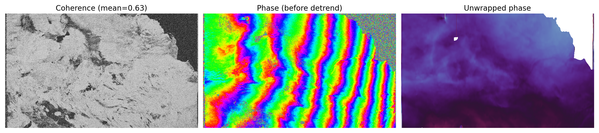
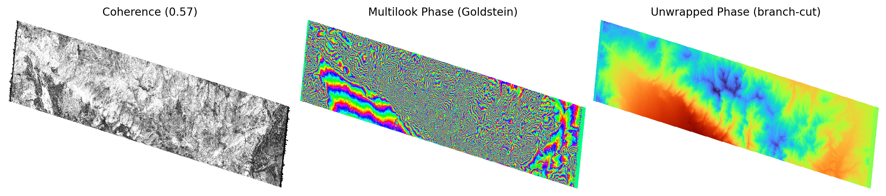

## InSAR.dev — Educational Examples

Minimal, self-contained InSAR processing examples for learning and teaching. Each example implements a complete interferometric pipeline from scratch using only basic scientific Python libraries.

## Examples

### [NISAR/nisar.py](NISAR/nisar.py) — NISAR Unwrapped Interferogram in 76 Lines of Python (38s)

A compact NISAR L-band interferogram processor and unwrapper using **numpy**, **h5py**, **scipy** and **opencv** (+ matplotlib for plotting). Flat linear script, every step visible top-to-bottom with no function jumps. 76 lines of Python, 38s on Apple M4.

### [NISAR/nisar_numpy.py](NISAR/nisar_numpy.py) — NISAR Unwrapped Interferogram in 200 Lines of Python (54s)

NISAR L-band interferogram processor and unwrapper in 200 lines of Python using only **numpy** and **h5py** (+ matplotlib for plotting). Pure signal processing in radar coordinates, 54s on Apple M4.

Both produce unwrapped interferograms matching NASA ASF product `NISAR_L2_PR_GUNW_005_172_A_008_006_2000_SH_20251122T024618_20251122T024652_20251204T024618_20251204T024653_X05007_N_F_J_001`.

**Data:** Uses NISAR RSLC HDF5 files downloaded by the notebook example [NISAR L-Band HH/HV RGB composite, HH interferogram, and unwrapped phase](https://github.com/InSARdev/core) from the [InSAR.dev](https://InSAR.dev) processing ecosystem.

### [Sentinel-1/s1.py](Sentinel-1/s1.py) — Sentinel-1 TOPS Interferogram in 243 Lines of Python (80s)

A self-contained Sentinel-1 C-band TOPS burst interferogram processor with orbital processing, TOPS deramping, amplitude cross-correlation coregistration, differential reramp, flat-earth removal, Gaussian and Goldstein filtering, multilooking, branch-cut unwrapper, and geocoding. Uses **numpy**, **scipy**, **tifffile**, **cv2**, and **ortools** (+ matplotlib for plotting). 243 lines of Python, 80s on Apple M4.

Uses dataset downloaded in the [InSAR.dev](https://InSAR.dev) example **Erzincan Elevation, Türkiye (2019)** — DEM generation from a single Sentinel-1 interferometric pair. Reproduces the ESA tutorial [DEM generation with Sentinel-1 IW](https://step.esa.int/docs/tutorials/S1TBX%20DEM%20generation%20with%20Sentinel-1%20IW%20Tutorial.pdf). The processing generates a complicated elevation map and it uses a production-ready phase unwrapper written initially for the InSAR.dev project years ago; most of the time is spent on unwrapping, 80s total.

## License

[MIT](LICENSE)
