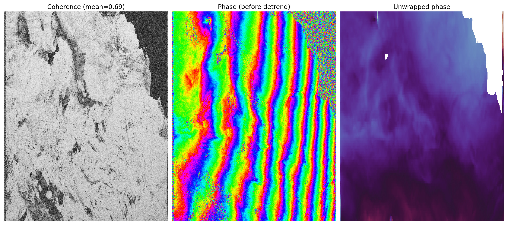

## InSAR.dev — Educational Examples

Minimal, self-contained InSAR processing examples for learning and teaching. Each example implements a complete interferometric pipeline from scratch using only basic scientific Python libraries.

## Examples

### [NISAR/nisar_numpy.py](NISAR/nisar_numpy.py) — NISAR Interferogram in 200 Code Lines

A complete NISAR L-band interferogram processor in 200 lines of Python using only **numpy** and **h5py** (+ matplotlib for plotting). Pure signal processing in radar coordinates. The unwrapped interferogram matches NASA ASF product `NISAR_L2_PR_GUNW_005_172_A_008_006_2000_SH_20251122T024618_20251122T024652_20251204T024618_20251204T024653_X05007_N_F_J_001`.

**Data:** Uses NISAR RSLC HDF5 files downloaded by the notebook example [NISAR L-Band HH/HV RGB composite, HH interferogram, and unwrapped phase](https://github.com/InSARdev/core) from the [InSAR.dev](https://InSAR.dev) processing ecosystem.

## License

[MIT](LICENSE)
